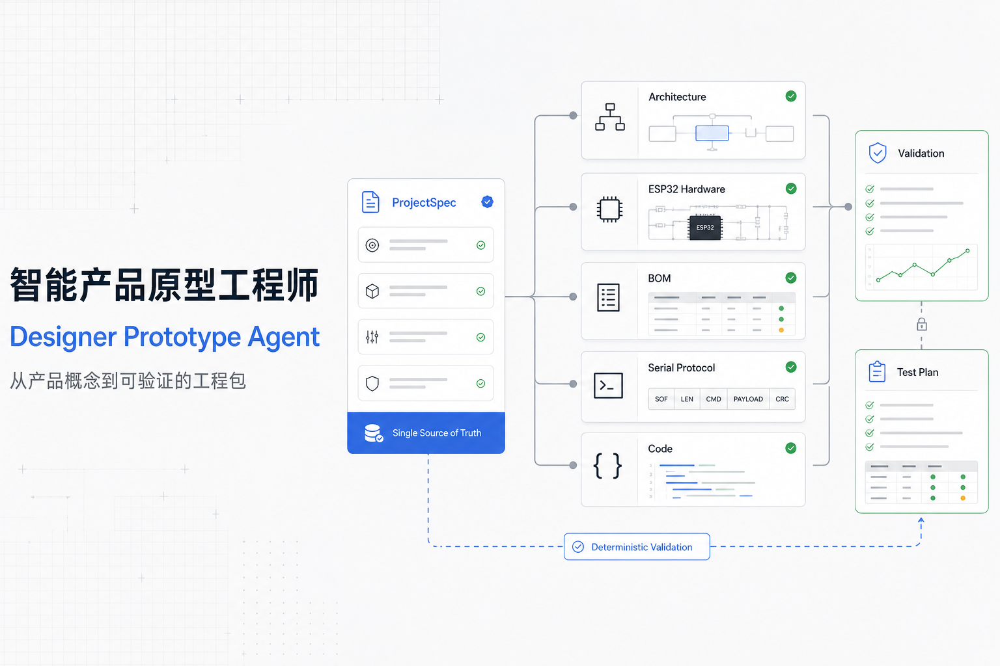
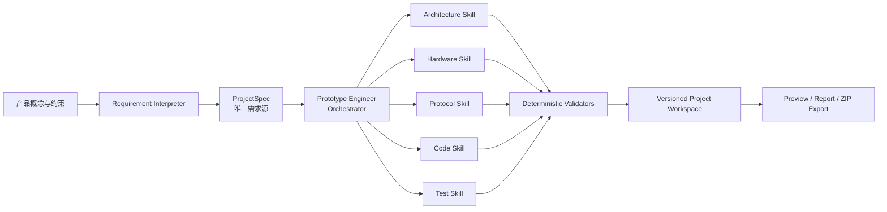

# Designer Prototype Agent

> 智能产品原型工程师 Agent：把工业设计概念转化为可追溯、可验证、可继续制造的工程包。



Designer Prototype Agent 是一个面向工业设计、智能产品开发与具身交互研究的 AI Agent 项目。它不是只输出建议的通用聊天机器人，而是一条从自然语言需求到系统架构、器件方案、通信协议、固件、Python 工具、测试计划和交付文档的工程化工作流。

项目以版本化 `ProjectSpec` 作为唯一需求源：大模型负责理解模糊意图、生成候选方案与解释，确定性程序负责电气约束、协议一致性、文件生成和验证状态。无法从数据手册或实物测试确认的信息会明确标记为“待确认”，不会被包装成已验证事实。

## 项目定位

- **研究方向**：AI Agent、工业设计、智能产品开发、HCI、具身智能原型。
- **核心问题**：如何让设计概念跨越需求澄清、软硬件协同和验证记录之间的工程断层。
- **目标用户**：工业设计师、交互设计师、创客、研究人员和智能硬件原型团队。
- **输出目标**：生成可阅读、可追溯、可编译、可测试的项目工作区，而不仅是一次性对话。

## 核心能力

1. **对话式需求规划**：用户先描述模糊想法，Agent 展示意图置信度、推进计划、推测选项与拟调用工具；用户确认后才创建或更新带来源和验证状态的 `ProjectSpec`。高级表单仅作为精确编辑入口。
2. **候选器件推荐**：当用户不知道具体型号时，给出带取舍、适用条件和待核对项的候选方案，再由用户确认。
3. **系统级生成**：从同一份需求生成架构、BOM、接线表、电源预算、串口协议、ESP32 固件、Python 工具和测试文档。
4. **版本与影响分析**：核心需求变更创建新版本，并标记需要重新生成或重新验证的下游资产。
5. **确定性验证**：检查 GPIO、I²C、电平、电机驱动、电源预算、协议结构和生成文件完整性。
6. **模型可替换**：DeepSeek 与 Mock Provider 均通过 `ModelProvider` 接口接入；模型、密钥、超时和重试只来自配置。
7. **工程包交付**：支持文件预览、验证记录、版本恢复和完整 ZIP 导出。

## Agent 架构



这套架构将职责分成两类：

- **模型擅长的部分**：解释自然语言、发现缺失条件、提出候选器件、生成代码草案和说明。
- **程序必须负责的部分**：版本控制、Schema、文件路径、协议同步、电气规则、测试状态和审计记录。

详细设计见 [系统架构](docs/system_architecture.md) 与 [Agent 工作流程](docs/workflow.md)。

## 三种运行形态

| 形态 | 主要用途 | Web/API | 持久化 | 工程执行能力 |
| --- | --- | --- | --- | --- |
| Cloudflare 托管 | 在线演示 | Vinext + Worker API | Cloudflare D1 | 静态验证与工程包生成 |
| Vercel 托管 | 在线演示与研究展示 | Vinext + Nitro Node API | Neon / Supabase PostgreSQL | 静态验证与工程包生成 |
| 本地工程执行器 | 开发、研究与真实工具链验证 | FastAPI | SQLite + 项目目录 | Pytest、Python、PlatformIO |

两种托管目标共用 TypeScript Agent 业务层，通过运行时适配器连接 D1 或 PostgreSQL。本地 FastAPI 继续承担真实工具链执行。它们的边界、差异和后续统一计划记录在 [开发说明](docs/development_notes.md)。

## 技术栈

- **前端**：React 19、Next.js 16、Vinext、TypeScript、Tailwind CSS
- **托管 API**：Cloudflare Worker 或 Nitro/Vercel Node.js Function
- **托管数据**：Drizzle ORM、Cloudflare D1、Neon/Supabase PostgreSQL
- **本地 API / Agent**：FastAPI、Pydantic、SQLAlchemy、HTTPX
- **模型接入**：DeepSeek OpenAI-compatible API、Mock Provider
- **嵌入式原型**：ESP32、PlatformIO、Arduino
- **质量保障**：ESLint、Node Test Runner、Pytest、确定性工程校验器

## 仓库结构

```text
app/                    Web 工作台界面
server/                 托管 TypeScript API、生成器与 ZIP 导出
worker/                 Cloudflare Worker 入口
nitro/                  Vercel/Nitro 同源 API 入口
db/                     D1 与 PostgreSQL 数据模型
drizzle-postgres/       Vercel PostgreSQL 迁移
apps/api/               FastAPI、本地 Agent 核心、生成器与测试
packages/schemas/       共享 ProjectSpec JSON Schema
catalogs/components/    示例器件目录
examples/               可重复生成的智能专注指环案例
docs/                   架构、流程、安全与开发说明
public/                 项目展示图与静态资源
```

运行时生成的 `data/`、`projects/`、构建缓存和本地密钥不会进入 Git。

## 快速开始

要求 Node.js 22.13+、pnpm、Python 3.11+。默认使用 Mock Provider，不需要 API Key。

```bash
cp .env.example .env
pnpm install

python3 -m venv .venv
source .venv/bin/activate
pip install -r apps/api/requirements.txt

pnpm dev
```

终端会打印 Cloudflare 本地 Web 地址。网页默认使用同源 `/api`。

需要本机 Python 与 PlatformIO 执行能力时，另开终端：

```bash
source .venv/bin/activate
cd apps/api
uvicorn app.main:app --reload --port 8000
```

FastAPI 文档位于 `http://localhost:8000/docs`。

## Vercel 构建

Vercel 目标使用 Nitro 生成 Build Output API v3 目录，不替换现有 Cloudflare 路径：

```bash
pnpm build:vercel
test -f .vercel/output/config.json
```

在线持久化必须配置 `DATABASE_URL` 并先执行：

```bash
pnpm db:migrate:postgres
```

完整的数据库、环境变量、Vercel 控制台和部署后验收步骤见 [Vercel 部署说明](docs/deploy-vercel.md)。当前仓库只准备部署产物，不自动执行生产部署。

## 接入 DeepSeek

在未提交的 `.env` 中配置：

```env
MODEL_PROVIDER=deepseek
DEEPSEEK_API_KEY=你的密钥
DEEPSEEK_BASE_URL=https://api.deepseek.com
DEEPSEEK_DEFAULT_MODEL=deepseek-v4-flash
DEEPSEEK_REASONING_MODEL=deepseek-v4-pro
DEEPSEEK_CODING_MODEL=deepseek-v4-pro
```

模型名称应以 DeepSeek 控制台当前可用模型为准。启动本地 API 后验证连接：

```bash
curl -X POST http://localhost:8000/api/agent/test
```

返回 `DEEPSEEK_CONNECTION_OK`、实际模型名和 Token 用量表示连接成功。API Key 只能存放在本地 `.env` 或部署平台的加密环境变量中。

## 使用流程

1. 在“新建项目”中描述用户、交互、硬件、软件、预算与安全约束。
2. Agent 生成 `ProjectSpec v1`，列出假设、待确认项和器件候选。
3. 用户确认候选方案；核心需求变化会创建新版本，不会覆盖已接受结果。
4. Orchestrator 按架构、硬件、协议、代码和测试模块生成工程资产。
5. 确定性校验器输出 `PASS`、`FAIL` 或 `NOT_RUN`，并记录依据。
6. 用户预览文件、查看验证历史，或导出完整工程包继续开发。

## 依赖与验证

前端依赖由根目录 `package.json` 与 `pnpm-lock.yaml` 锁定；Python 依赖由 `apps/api/requirements.txt` 和 `apps/api/pyproject.toml` 管理。

```bash
pnpm lint
pnpm test
pnpm exec tsc --noEmit
pnpm build:cloudflare
pnpm build:vercel

cd apps/api
pytest
python scripts/generate_example.py

cd ../../examples/project-408f45c1/04_firmware
pio run
```

只有真实执行成功的检查才会被记录为通过。未安装工具链或未连接实物时，相关状态保持 `NOT_RUN`。完整验收范围见 [功能验收矩阵](docs/acceptance-matrix.md)。

## 项目截图

当前 README 使用 [项目封面](public/og.png) 展示从 `ProjectSpec` 到架构、硬件、协议、代码和验证的核心链路。后续界面截图建议统一放入 `docs/assets/`，覆盖需求确认、器件推荐、工程生成和验证记录四个场景。

## 安全边界

本项目只辅助低压、有人值守的原型开发。首次上电前必须人工检查接线；电机与大电流负载必须使用合适驱动器并确认启动电流；运动机构必须保留急停。市电、高压、高温、大功率、医疗或人体安全相关项目必须由专业人员复核。详见 [安全说明](docs/safety.md)。

## 后续规划

- 统一托管 TypeScript API 与本地 Python 执行器的领域逻辑和契约测试。
- 增加用户认证、项目隔离、速率限制与模型用量控制。
- 扩展经数据手册核验的器件目录和可追溯引用。
- 增加真实硬件在环测试与更多 ESP32 原型案例。
- 建立协议、固件、Python SDK 和文档的联动更新检查。
- 补充研究评估：任务完成率、工程错误率、人工确认成本和可复现性。

## 开源状态

项目正在整理为个人技术作品、研究交流与开源展示仓库。正式授予开源许可前仍需由项目所有者选择并添加 `LICENSE`。
