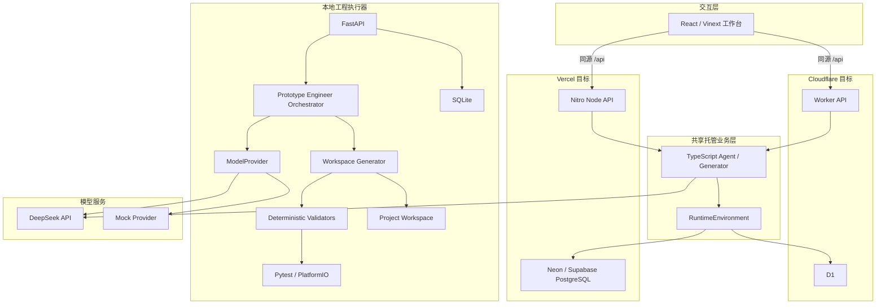
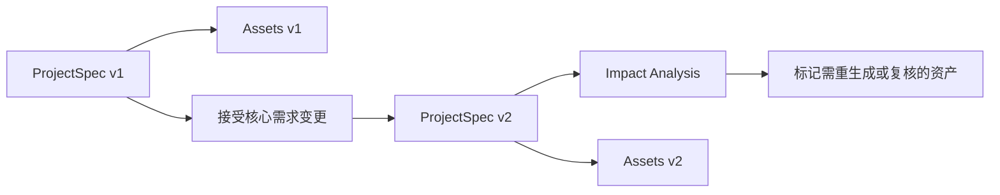

# 系统架构

## 1. 架构目标

Designer Prototype Agent 的目标不是生成一段孤立回答，而是维护一个可追溯的智能产品工程项目。架构遵循四条原则：

1. `ProjectSpec` 是需求的唯一事实源。
2. 大模型处理模糊理解与候选生成，确定性代码处理精确约束。
3. 每个派生资产都能追溯到 `ProjectSpec` 版本。
4. 未验证的工程信息必须保留验证状态，不能被默认视为事实。

## 2. 总体结构



托管运行时服务在线工作台。Cloudflare 使用 Worker 与 D1；Vercel 使用 Nitro Node Function 与 PostgreSQL。二者共用 `server/api.ts`，业务逻辑只依赖 `RuntimeEnvironment`、`DatabaseAdapter`、`ModelProvider`、`AssetStorageAdapter` 和 `ExecutionCapabilities`。FastAPI 路径用于本地工程执行、SQLite 持久化和真实 Python/PlatformIO 工具链，不在托管函数内运行。

## 3. 核心模块

| 模块 | 位置 | 职责 |
| --- | --- | --- |
| Web 工作台 | `app/` | 项目创建、需求确认、模块导航、文件预览、验证记录 |
| 托管 API | `server/api.ts` | 在线项目、版本、消息、生成、验证与导出接口 |
| 托管生成器 | `server/generator.ts` | 确定性工程资产与校验结果生成 |
| Worker 入口 | `worker/index.ts` | 将前端请求和 `/api` 路由到对应处理器 |
| Nitro 入口 | `nitro/server/routes/api/[...path].ts` | 将 Vercel `/api` 请求交给共享处理器 |
| 运行时适配 | `server/runtime/` | 隔离平台数据库、模型、身份与能力边界 |
| D1 数据层 | `db/schema.ts`、`drizzle/` | Cloudflare 项目、版本、运行、资产和验证记录 |
| PostgreSQL 数据层 | `db/schema.postgres.ts`、`drizzle-postgres/` | Vercel 持久化与迁移 |
| FastAPI | `apps/api/app/main.py` | 本地 API 路由与工程执行入口 |
| Orchestrator | `apps/api/app/orchestrator.py` | 编排需求、架构、硬件、协议、代码和测试 Skill |
| 模型抽象 | `apps/api/app/providers.py` | 隔离 DeepSeek 与 Mock Provider |
| 本地生成器 | `apps/api/app/generator.py` | 生成版本化项目工作区 |
| 确定性校验 | `apps/api/app/validators.py` | GPIO、电平、电源、协议和文件完整性检查 |
| 领域 Schema | `apps/api/app/schemas.py`、`packages/schemas/` | 定义并导出 `ProjectSpec` 契约 |
| 示例项目 | `examples/project-408f45c1/` | 智能专注指环端到端参考输出 |

## 4. 领域数据与版本

`ProjectSpec` 包含目标、用户、交互、功能、硬件、软件、预算、安全边界、假设和待确认项。重要字段应保存：

- `value`
- `source`
- `confidence`
- `verification_status`
- `notes`

创建项目时保存 `ProjectSpec v1`。核心需求被接受后创建新版本，并记录变更理由与受影响模块。架构、BOM、接线、协议、固件、Python 工具和测试文档属于派生资产，必须引用生成时的 Spec 版本。



## 5. Agent 编排

主 Orchestrator 只协调稳定且范围明确的 Skill：

1. Requirement Interpreter：把自然语言转为结构化需求草案。
2. Architecture Skill：生成系统边界、数据流、控制流和状态机。
3. Hardware Skill：生成候选器件、BOM、接线与电源预算。
4. Protocol Skill：生成串口帧、命令、错误码和 Schema。
5. Code Skill：生成 ESP32 与 Python 工程草案。
6. Test Skill：生成测试计划、用例和首次上电清单。

模型输出不能绕过 Schema 和确定性校验器。模型调用失败时可以回退到确定性模板，但必须记录实际 Provider、模型、错误和回退状态。

## 6. 持久化与工程资产

托管端使用 D1 保存：

- projects
- project_versions
- messages
- agent_runs
- artifacts
- validations

本地端使用 SQLite 保存对应元数据，并把文件写入项目工作区。工程文件按固定阶段目录组织：

```text
00_input/
01_requirements/
02_architecture/
03_hardware/
04_firmware/
05_python/
07_protocol/
08_testing/
09_reports/
```

运行时的数据库、用户项目和导出 ZIP 均为本地或部署数据，不属于源代码仓库。

## 7. 信任与安全边界

- 浏览器不能持有 DeepSeek API Key；密钥仅存在服务端环境变量。
- 当前公开托管版本仍需补充用户认证、项目隔离、限流和用量配额，才能作为多租户服务使用。
- 静态检查不能替代数据手册核验、实物接线检查、首次上电流程和硬件在环测试。
- 高压、市电、高温、大功率、医疗、人体安全和危险机械不在无人审查的自动化范围内。

## 8. 已知架构债务

托管 TypeScript 路径与本地 Python 路径存在部分重复的领域逻辑。短期通过共享 `ProjectSpec`、固定目录结构和验收矩阵保持行为一致；长期应抽取统一契约测试，并明确哪些能力只允许在受控的本地执行器中运行。
