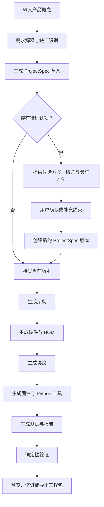

# Agent 工作流程

## 1. 从概念到工程包

## 2. 阶段说明

### 阶段 A：需求输入

用户填写目标用户、核心场景、交互方式、外形约束、供电、连接方式、预算、开发经验和安全要求。原始描述原样保留在 `00_input/`，用于审计和回溯。

### 阶段 B：需求解释

Requirement Interpreter 将自然语言拆分为：

- 已明确的事实与约束
- 合理但尚未确认的假设
- 会阻塞工程选择的问题
- 需要进一步核验的数据手册或实物条件

每个重要字段记录来源、置信度、验证状态和备注。

### 阶段 C：候选方案确认

当用户不知道器件具体型号时，Agent 不要求用户先自行填写型号，而是给出少量候选：

- 候选名称与器件类别
- 为什么适合当前需求
- 关键取舍
- 仍需核验的数据
- 对预算、供电、尺寸、协议和软件的影响

候选只能基于仓库中已核验的目录或明确标记为待核验的信息。引脚、电压、电流、地址、价格、库存和兼容性不能凭空补全。

### 阶段 D：ProjectSpec 接受与版本化

初次确认形成 `ProjectSpec v1`。之后只有被用户接受的核心需求变更才创建新版本。版本记录必须包含：

- 变更原因
- 受影响的字段
- 受影响的架构、硬件、协议、代码、测试或文档模块
- 需要重新确认或重新生成的资产

普通问答不会静默改写已经接受的 Spec。

### 阶段 E：专业模块生成

Orchestrator 按依赖顺序调度：

1. 系统架构
2. 硬件和电源
3. 通信协议
4. 固件和上位机代码
5. 测试与工程报告

每个模块先读取当前 `ProjectSpec` 版本，再生成文件并注册为 Artifact。协议发生变化时，Schema、固件、Python 实现、测试和文档必须同步更新。

### 阶段 F：验证

验证结果使用明确状态：

- `PASS`：检查命令真实执行且成功。
- `FAIL`：检查真实执行但发现问题。
- `NOT_RUN`：工具、环境、实物或人工步骤尚未执行。
- `待确认` / `尚未验证`：信息缺少可靠依据。

Web 托管环境只执行安全的静态或确定性检查。本机 FastAPI 工程执行器负责运行 Pytest、PlatformIO 等真实工具；实物测试始终需要用户或专业人员执行。

### 阶段 G：修订与交付

用户可以查看文件、验证记录、模型运行、Token 用量和失败信息。若需求变化，流程回到版本化阶段；若当前结果可接受，则导出完整 ZIP 作为后续开发输入。

## 3. 典型产物

| 阶段 | 主要产物 |
| --- | --- |
| 输入 | 原始需求描述 |
| 需求 | ProjectSpec JSON/YAML、假设、待确认问题 |
| 架构 | 功能架构、数据流、控制流、状态机 |
| 硬件 | BOM、候选器件、接线表、电源预算、硬件验证 |
| 协议 | 协议说明、JSON Schema、错误码 |
| 固件 | PlatformIO 工程、模块代码、README |
| Python | 数据接收、保存与分析工具 |
| 测试 | 测试计划、测试用例、首次上电清单、故障排查 |
| 报告 | 工程摘要与验证报告 |

## 4. 智能专注指环参考流程

仓库的 `examples/project-408f45c1/` 用智能专注指环验证垂直流程：旋转交互需求进入 `ProjectSpec`，再派生 ESP32 架构、编码器与驱动候选、USB 串口协议、PlatformIO 固件、Python 数据工具和测试计划。

该案例只证明已实现流程的稳定价值。新增 Skill 前应先说明它对该案例或同类智能产品原型的实际增益，避免为假设性规模过度设计。
